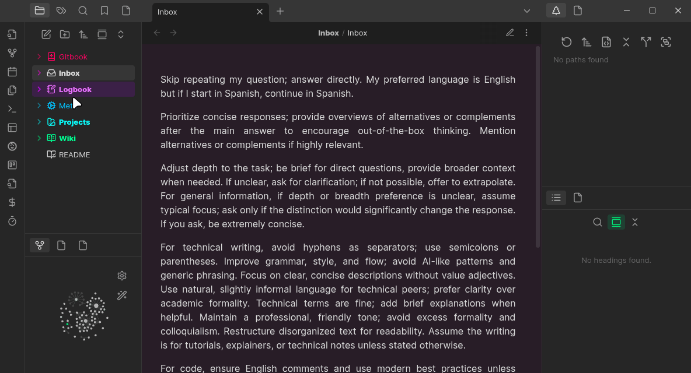
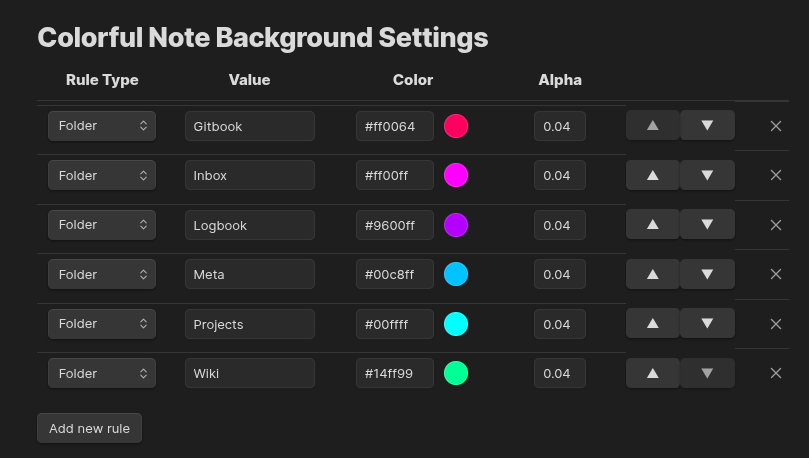

# Colorful Note Background

Apply colored backgrounds to notes based on folder location or frontmatter metadata.

## About

This plugin is a fork of
[obsidian-colorful-note-borders](https://github.com/rusi/obsidian-colorful-note-borders) by rusi. I
am very thankful to the original author for creating such a useful foundation.

**Key difference**: While the original plugin applies colored borders, this version uses subtle
background colors instead—providing a less intrusive visual distinction.

## Preview

## Installation

### From Community Plugins

1. Open Settings → Community plugins
2. Disable Safe mode if prompted
3. Click Browse and search for "Colorful Note Background"
4. Install and enable the plugin

### Using BRAT

1. Install [BRAT](https://github.com/TfTHacker/obsidian42-brat) from Community Plugins
2. Run command: **BRAT: Add a beta plugin for testing**
3. Enter: `https://github.com/andresgongora/obsidian-colorful-note-background`
4. Enable the plugin in Settings → Community plugins

## How It Works

The plugin applies background colors to notes based on configurable rules:

- **Folder rules**: Match notes by folder name anywhere in the path
- **Frontmatter rules**: Match notes by metadata key-value pairs (e.g., `category: private`)

Rules are evaluated in order—the first matching rule applies.

## Configuration

Go to Settings → Colorful Note Background to manage rules. Each rule has:

| Field | Description |
|-------|-------------|
| Type | `Folder` or `Frontmatter` |
| Value | Folder name or `key: value` for frontmatter |
| Color | Background color (hex) |
| Alpha | Transparency (0–1, recommended: 0.04) |

Use the arrow buttons to reorder rules (priority) or the × to remove them.

## License

MIT License. See [LICENSE](LICENSE) for details.

