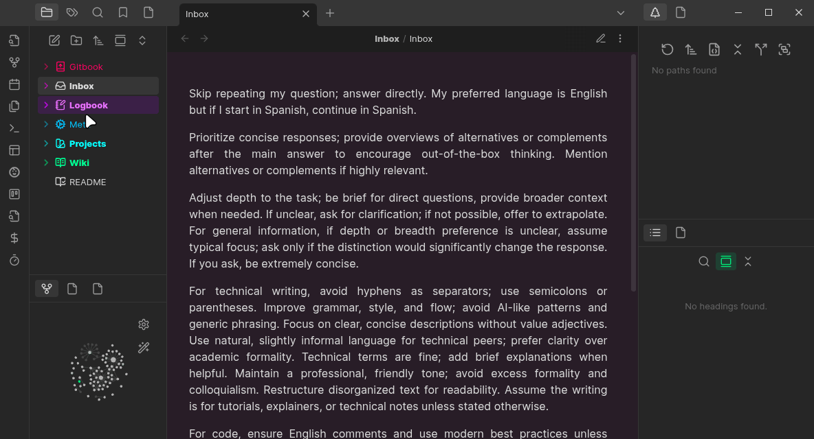
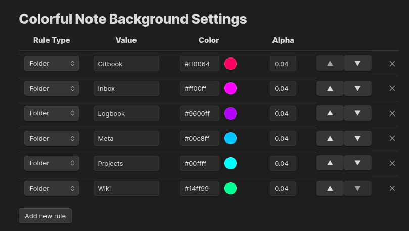

# Colorful Note Background

Colorful Note Background is an Obsidian plugin that tints a note's background color based on its
folder or its frontmatter metadata. Set a rule once and every matching note carries a subtle,
consistent color cue, so you can tell folders and note types apart at a glance without reading the
file path.

<!------------------------------------------------------------------------------------------------->
## Preview
<!------------------------------------------------------------------------------------------------->

<!------------------------------------------------------------------------------------------------->
## Installation
<!------------------------------------------------------------------------------------------------->

### From Community Plugins

1. Open Settings → Community plugins.
2. Disable Safe mode if prompted.
3. Click Browse and search for "Colorful Note Background".
4. Install and enable the plugin.

### Using BRAT

1. Install [BRAT](https://github.com/TfTHacker/obsidian42-brat) from Community Plugins.
2. Run command: **BRAT: Add a beta plugin for testing**.
3. Enter: `https://github.com/andresgongora/obsidian-colorful-note-background`.
4. Enable the plugin in Settings → Community plugins.

<!------------------------------------------------------------------------------------------------->
## How It Works
<!------------------------------------------------------------------------------------------------->

The plugin applies background colors to notes based on configurable rules:

- **Folder rules**: Match notes by folder name anywhere in the path
- **Frontmatter rules**: Match notes by metadata key-value pairs (e.g., `category: private`)

Rules are evaluated in order. The first matching rule applies.

<!------------------------------------------------------------------------------------------------->
## Configuration
<!------------------------------------------------------------------------------------------------->

Use subtle colors with low alpha values so the background doesn't overpower note content. A
recommended alpha of 0.04 lets you tell folders and note types apart at a glance, without the color
competing with your text.

Go to Settings → Colorful Note Background to manage rules. Each rule has:

| Field | Description |
| ----- | ----------- |
| Type | `Folder` or `Frontmatter` |
| Value | Folder name or `key: value` for frontmatter |
| Color | Background color (hex) |
| Alpha | Transparency (0–1, recommended: 0.04) |

Use the arrow buttons to reorder rules (priority) or the × to remove them.

<!------------------------------------------------------------------------------------------------->
## Privacy
<!------------------------------------------------------------------------------------------------->

This plugin makes no network calls, collects no telemetry, and does not access files outside your
vault. Settings are the only data stored (via Obsidian's local plugin data).

<!------------------------------------------------------------------------------------------------->
## Origin
<!------------------------------------------------------------------------------------------------->

Colorful Note Background is a fork of
[obsidian-colorful-note-borders](https://github.com/rusi/obsidian-colorful-note-borders) by rusi.
The original plugin outlines notes with colored borders; this fork replaces the border with a subtle
background tint instead, for a less intrusive visual cue.

<!------------------------------------------------------------------------------------------------->
## Support
<!------------------------------------------------------------------------------------------------->

If this project helped you, consider [buying me a coffee](https://buymeacoffee.com/andresgongora).

<!------------------------------------------------------------------------------------------------->
## License
<!------------------------------------------------------------------------------------------------->

MIT License. See [LICENSE](LICENSE) for details.
